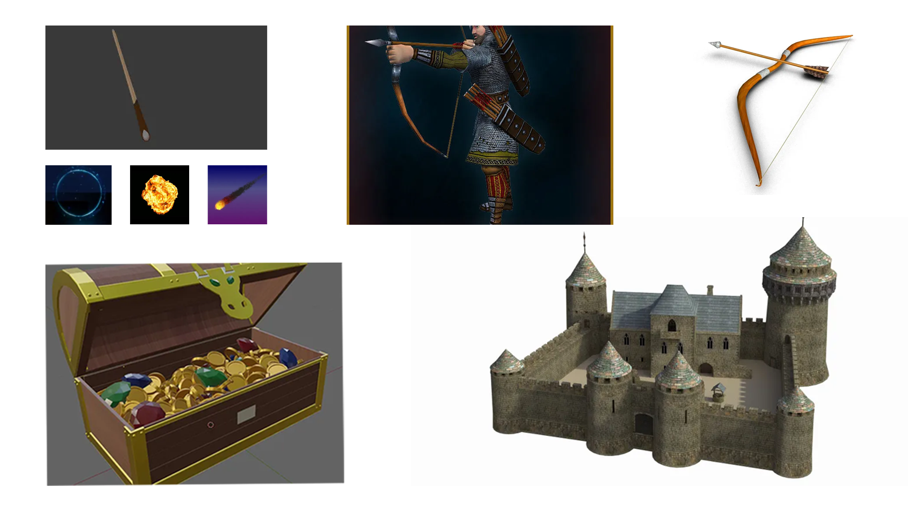
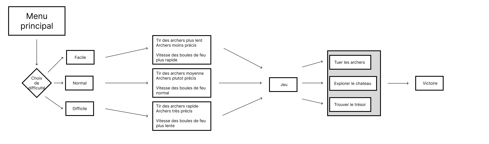
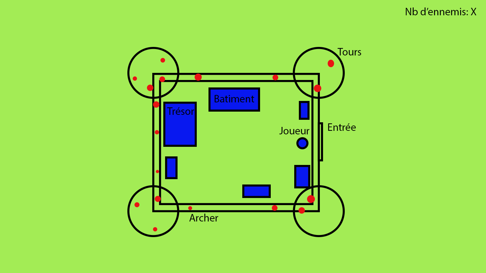

# Wand-erful
Vous êtes un sorcier dont la mission est de voler le trésor d'un château ennemi.

Vous devez entrer dans le château, puis éliminer les archers qui tenteront de vous tuer. Vous disposerez d'un sort de bouclier pour vous protéger et d'un sort de boule de feu pour attaquer. Vous devrez trouver le trésor et éliminer le chef des archers pour vaincre le niveau. Plusieurs niveaux de difficulté seront disponibles.

## Moodboard

### Visuel

### Sonore

ambience à l'intérieur du chateau: https://www.youtube.com/watch?v=BwV1azM1Ifw&ab_channel=MichaelGhelfiStudios

ambience à l'extérieur:(à 40min) https://www.youtube.com/watch?v=eifwZFRSydQ&ab_channel=EpixAmbience

passage de checkpoint: (intro de percussion) https://www.youtube.com/watch?v=mjjkHg5FOhk&ab_channel=sonic4real

## Schéma de programmation

## Plan de l'environement

